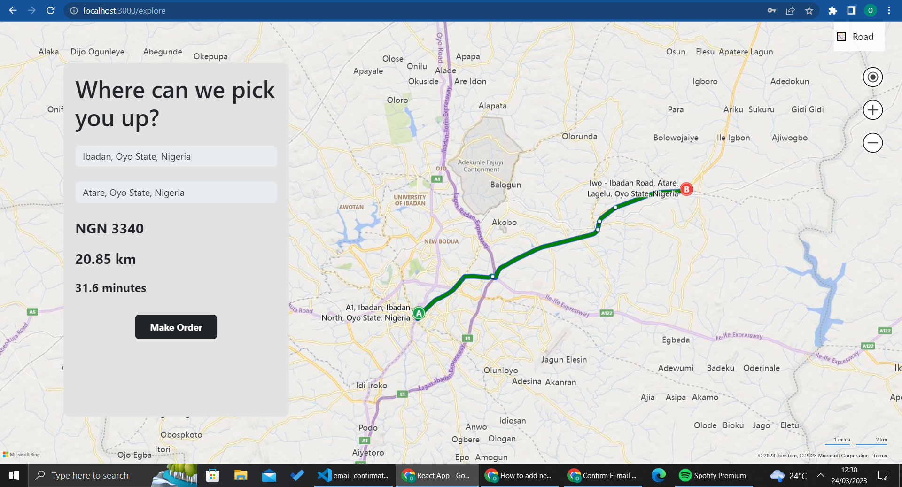

# TaxiHub-2.0
This taxi-hailing application is built with React and Django REST framework. It provides an easy-to-use platform for users to book and manage their taxi rides. The app includes features like real-time ride tracking, fare estimation, and user reviews.

Taxi Hailing App\
This is a taxi hailing app built with Django and React. It allows users to request rides and drivers to accept those requests.

## Installation
To install the app, follow these steps:

### Backend
1. Clone the repository:
`git clone https://github.com/Davidcode-png/TaxiHub-2.0.git`

2. Navigate to the project directory:
`cd server`

3. Create a virtual environment:
`python3 -m venv env`

4. Activate the virtual environment:
`env/scripts/activate`

5. Install the backend requirements:
`pip install -r requirements.txt`

6. Set up the database:
`python manage.py migrate`

7. Run the backend server:
`python manage.py runserver`

### Frontend
In a new terminal, navigate to the project directory:
`cd client`
`cd taxihub`

1. Install the frontend dependencies:
`npm install`
2. Run the frontend server:
`npm start`
The app should now be running at http://localhost:3000/.

# Features
## User Authentication
Users can sign up for an account, log in, and log out. Passwords are hashed for security.

## Ride Requests
Users can request a ride by specifying their pickup location and destination. The request is added to the list of available rides.

## Driver Dashboard
Drivers can log in and view a dashboard of available ride requests. They can accept a ride request and mark it as completed.

## Real-Time Updates
The list of available ride requests and the driver dashboard update in real time using websockets.

## Admin Panel
An admin panel is available for managing users, ride requests, and drivers. Only users with the "staff" status can access the admin panel.

# Some Images

  
  
  
  

